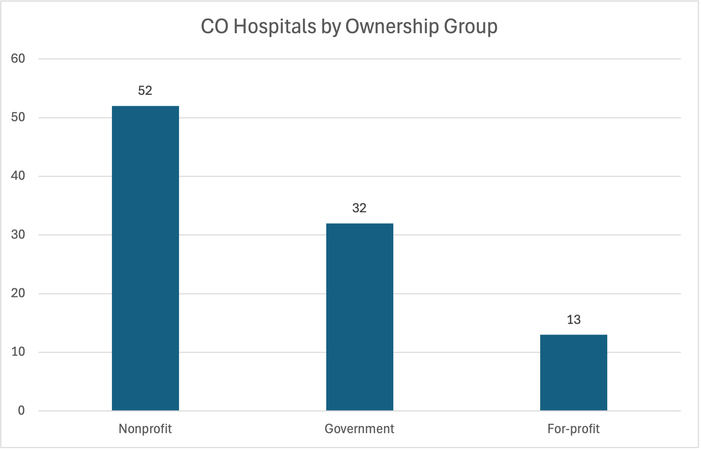
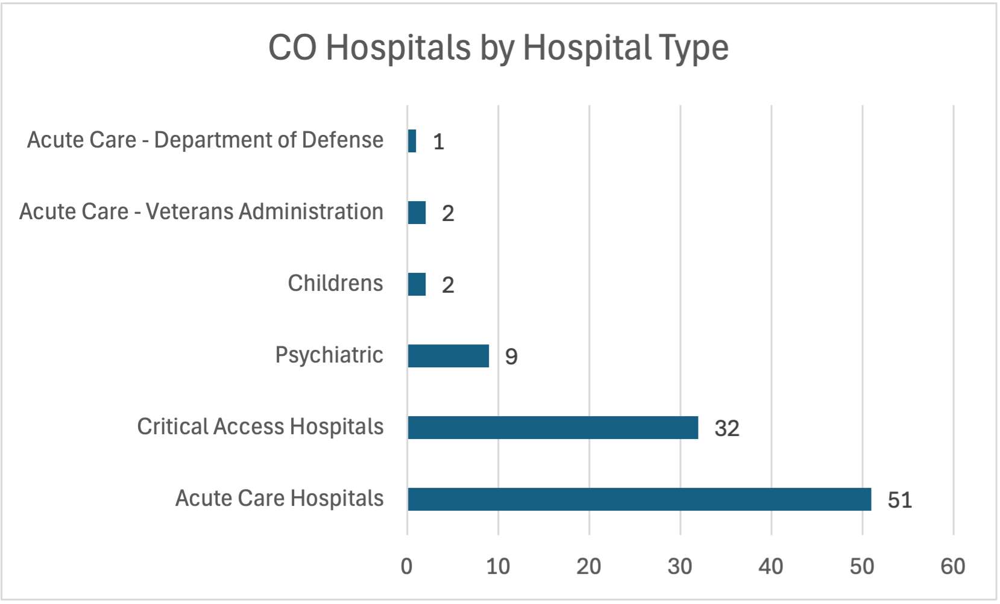

# colorado-hospital-analysis
Beginner SQL portfolio project analyzing Colorado hospital quality and access using CMS data.
# Colorado Hospital Quality and Access Analysis

## Project Overview

This beginner SQL portfolio project analyzes Colorado hospital data from the Centers for Medicare & Medicaid Services.

The goal is to examine hospital availability, emergency services, ownership, hospital type, and CMS overall ratings using SQL.

The project focuses on translating SQL results into clear business findings that could support healthcare operations, planning, and quality discussions.

## Business Questions

This analysis answers the following questions:

1. How many hospitals are listed in Colorado?
2. How many Colorado hospitals provide emergency services?
3. What hospital types are most common?
4. How are hospitals distributed by ownership group?
5. How many hospitals have an available CMS overall rating?
6. What is the average rating among hospitals with available ratings?
7. Which hospitals received a five-star rating?
8. How do average ratings differ by ownership and hospital type?
9. Which Colorado cities have the most hospitals?
10. How many cities have only one listed hospital?

## Data Source

**Publisher:** Centers for Medicare & Medicaid Services  
**Dataset:** Hospital General Information  
**File:** `Hospital_General_Information.csv`

The dataset includes hospital names, locations, hospital types, ownership categories, emergency-service status, and CMS overall ratings.

## Tools Used

- SQLite
- DB Browser for SQLite
- SQL
- GitHub

## SQL Skills Demonstrated

- `SELECT`
- `WHERE`
- `ORDER BY`
- `LIMIT`
- `COUNT`
- `SUM`
- `AVG`
- `ROUND`
- `CASE`
- `CAST`
- `GROUP BY`
- `HAVING`
- `DISTINCT`
- Subqueries
- Data cleaning with `TRIM` and `UPPER`

## Key Findings

### Dataset Overview

- The full CMS dataset contains 5,432 hospital records.
- Colorado has 97 hospital records.
- Colorado hospitals are represented across 68 cities.

### Emergency Services

- 88 Colorado hospitals provide emergency services.
- 9 Colorado hospitals do not provide emergency services.
- 90.7% of Colorado hospitals provide emergency services.

### Hospital Types

- Acute Care Hospitals: 51
- Critical Access Hospitals: 32
- Psychiatric Hospitals: 9
- Children's Hospitals: 2
- Veterans Administration Acute Care Hospitals: 2
- Department of Defense Acute Care Hospitals: 1

Acute care hospitals represent 52.6% of Colorado hospitals, while critical access hospitals represent 33.0%.

### Hospital Ownership

- Nonprofit hospitals: 52
- Government hospitals: 32
- For-profit hospitals: 13

Nonprofit hospitals represent 53.6% of Colorado hospitals.

### Hospital Ratings

- 49 Colorado hospitals have an available CMS overall rating.
- 48 hospitals do not have an available rating.
- Rating availability is 50.5%.
- The average rating among hospitals with available ratings is 3.96 stars.
- Colorado has 14 five-star hospitals.

### Rating Availability

Rating availability varies by ownership group:

- Nonprofit: 71.2%
- For-profit: 30.8%
- Government: 25.0%

This difference is important because ownership-group rating comparisons are based on unequal amounts of available data.

### Average Rating by Ownership

Among hospitals with available ratings:

- Nonprofit hospitals averaged 4.05 stars.
- For-profit hospitals averaged 4.00 stars.
- Government hospitals averaged 3.50 stars.

These results should be interpreted cautiously because some ownership groups have small sample sizes and substantial missing rating data.

### Geographic Distribution

- Colorado Springs and Denver each have 7 listed hospitals.
- Aurora has 4.
- Grand Junction and Pueblo each have 3.
- 53 of the 68 represented cities have only one hospital.
- 77.9% of represented cities have only one listed hospital.

## Visualizations

### Colorado Hospitals by Ownership Group



Nonprofit hospitals represent the largest ownership group in Colorado, followed by government and for-profit hospitals.

### Colorado Hospitals by Hospital Type



Acute care hospitals are the most common hospital type in Colorado, while critical access hospitals represent the second-largest group.

## Main Conclusion

Colorado's hospital system includes a large number of acute care and critical access hospitals, with nonprofit ownership representing the largest ownership category.

Most Colorado hospitals provide emergency services, but CMS rating availability is incomplete. Only about half of Colorado hospitals have an available overall rating, and missing data is especially common among government, for-profit, critical access, psychiatric, and children's hospitals.

The analysis also shows that many Colorado communities have only one listed hospital. However, hospital count alone does not measure true healthcare access.

## Limitations

This project has several limitations:

- Hospital count does not measure hospital capacity.
- The dataset does not include population size.
- The analysis does not account for travel distance or travel time.
- The analysis does not measure bed count, staffing, or service volume.
- Nearly half of Colorado hospitals do not have an available CMS overall rating.
- Some rating comparisons are based on small sample sizes.
- This analysis describes patterns but does not prove that ownership or hospital type causes higher ratings.

## Repository Structure

```text
data/
    README.md

sql/
    README.md
    01_colorado_hospital_analysis.sql

results/
    README.md
    key_findings.md

README.md
